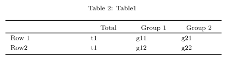

<!-- README.md is generated from README.Rmd. Please edit that file -->
<!-- USE THIS FILE TO CREATE THE FIGURES IN man/figures. Compile the PDF, take screenshots and save them as indicated in the knitr::include_graphics chunks -->

# btabler

<!--
`r badger::badge_custom("dev version", as.character(packageVersion("btabler")), "blue", "https://github.com/CTU-Bern/btabler")`
[](https://github.com/CTU-Bern/btabler/actions/workflows/R-CMD-full.yaml)
-->

```{r setup, include=FALSE}
knitr::opts_chunk$set(echo = TRUE,
                      fig.path = "man/figures/README-")
```

## Example usage 

### Installing the package

The package can be installed from [github](https://github.com/CTU-Bern/btabler) via the `remotes` package

```{r gh-installation, eval = FALSE}
# install.packages("remotes")
remotes::install_github("CTU-Bern/btabler")
```

Note that `remotes` treats any warnings (e.g. that a certain package was built under a different version of R) as errors. If you see such an error, run the following line and try again:

```{r remotes-error, eval = FALSE}
Sys.setenv(R_REMOTES_NO_ERRORS_FROM_WARNINGS = "true")
```

### Using the package 
Load it as usual:
```{r, message=FALSE}
library(btabler)
```

Create your tables via whatever means and pass them to the `btable` function:
```{r basic, echo = TRUE, results='asis'}
df <- data.frame(name = c("", "Row 1", "Row2"),
                 out_t = c("Total", "t1", "t1"),
                 out_1 = c("Group 1", "g11", "g12"), 
                 out_2 = c("Group 2", "g21", "g22"))
btable(df, nhead = 1, nfoot = 0, caption = "Table1")
```
`btable` returns the latex code for the table you passed, which can be easily used with sweave to create tables in reports.
```{r, echo=TRUE, eval=FALSE}
knitr::include_graphics("man/figures/basic.png")
```

Alignment can be changed via the `aligntot` argument:
```{r aligntot, echo = TRUE, eval = TRUE, results='asis'}
btable(df, nhead = 1, nfoot = 0, caption = "Table1", aligntot = "llll")
```
```{r, echo=TRUE, eval=FALSE}
knitr::include_graphics("man/figures/aligntot.png")
```

Column widths can also be modified using the `aligntot` argument:
```{r aligntot_width, echo = TRUE, eval = TRUE, results='asis'}
cwidths <- "p{3cm}p{1.5cm}p{1.5cm}p{1.5cm}"

btable(df, nhead = 1, nfoot = 0, 
       caption = "Table1", 
       aligntot = cwidths, rulelength = "6cm")
```
If the table is does not the widths entered in `aligntot`, set the `rulelength` argument can be used to fix the overall table width.
```{r, echo=TRUE, eval=FALSE}

```


Where there are multiple header lines, the `nhead` argument can be used and any neighboring cells in those first rows will be merged. 
```{r nhead, echo = TRUE, results='asis'}
df <- data.frame(name = c("", "", "Row 1", "Row2"),
                 out_t = c("Total", "mean (sd)", "t1", "t1"),
                 out_1 = c("Group 1", "mean (sd)", "g11", "g12"),
                 out_2 = c("Group 2", "mean (sd)", "g21", "g22"))
btable(df, nhead = 2, nfoot = 0, caption = "Table1", 
       aligntot = cwidths, rulelength = "6cm")
```
`btable` italicizes the second row of the header by default. This can be changed via the `head_it` argument:
```{r head_it, echo = TRUE, results='asis'}
btable(df, nhead = 2, nfoot = 0, caption = "Table1", 
       aligntot = cwidths, rulelength = "6cm", 
       head_it = NA)
```
```{r, echo=TRUE, eval=FALSE}
knitr::include_graphics("man/figures/head_it.png")
```
Likewise, aggregation of the header can also be turned of
```{r aggregate, echo = TRUE, results='asis'}
btable(df, nhead = 2, nfoot = 0, caption = "Table1", 
       aligntot = cwidths, rulelength = "6cm", 
       head_it = NA, aggregate = FALSE)
```
```{r, echo=TRUE, eval=FALSE}
knitr::include_graphics("man/figures/aggregate.png")
```

Footers can also be added
```{r footer, echo = TRUE, results='asis'}
df <- data.frame(name = c("", "Row 1", "Row2", "*Footer"),
                 out_t = c("Total", "t1", "t1", ""),
                 out_1 = c("Group 1", "g11", "g12", ""),
                 out_2 = c("Group 2", "g21", "g22", ""))
btable(df, nhead = 1, nfoot = 1, caption = "Table1", 
       aligntot = cwidths, rulelength = "6cm", 
       comment = FALSE)
```

```{r, eval=FALSE, echo = TRUE}
knitr::include_graphics("man/figures/footer.png")
```
## Requirements for the LaTeX header

`btabler` tables are only interpretable by LaTeX when a few packages are loaded. It is recommended to place the following code in the header of your `.tex` file or `.Rmd`

```
# .tex
\usepackage{longtable}
\usepackage{booktabs}
\usepackage{float}
\usepackage{array}
\newcolumntype{L}[1]{>{\raggedright\arraybackslash}m{#1}}
\newcolumntype{M}[1]{>{\centering\arraybackslash}m{#1}}
\newcolumntype{P}[1]{>{\centering\arraybackslash}p{#1}}

# .Rmd
header-includes:
  - \usepackage{longtable}
  - \usepackage{booktabs}
  - \usepackage{float}
  - \usepackage{array}
  - \newcolumntype{L}[1]{>{\raggedright\arraybackslash}m{#1}}
  - \newcolumntype{M}[1]{>{\centering\arraybackslash}m{#1}}
  - \newcolumntype{P}[1]{>{\centering\arraybackslash}p{#1}}
```

