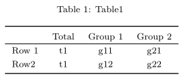

<!-- README.md is generated from README.Rmd. Please edit that file -->
<!-- USE THIS FILE TO CREATE THE FIGURES IN man/figures. Compile the PDF, take screenshots and save them as indicated in the knitr::include_graphics chunks -->

# btabler

<!--
`r badger::badge_custom("dev version", as.character(packageVersion("btabler")), "blue", "https://github.com/CTU-Bern/btabler")`
[](https://github.com/CTU-Bern/btabler/actions/workflows/R-CMD-full.yaml)
-->

```{r setup, include=FALSE}
knitr::opts_chunk$set(echo = TRUE,
                      fig.path = "man/figures/README-")
```

#README

`btabler` is a package which adds wraps the `xtable` package, adding additional 
functionality such as merging header columns.

Note that `btabler` does not produce HTML tables. If using `.Rmd`, `output` should be 
`pdf_document`.

## Example usage 

### Installing the package

The package can be installed from [github](https://github.com/CTU-Bern/btabler) 
via the `remotes` package

```{r gh-installation, eval = FALSE}
# install.packages("remotes")
remotes::install_github("CTU-Bern/btabler")
```

Note that `remotes` treats any warnings (e.g. that a certain package was built 
under a different version of R) as errors. If you see such an error, run the 
following line and try again:

```{r remotes-error, eval = FALSE}
Sys.setenv(R_REMOTES_NO_ERRORS_FROM_WARNINGS = "true")
```

### Using the package 
Load it as usual:
```{r, message=FALSE}
library(btabler)
```

Create your tables via whatever means and pass them to the `btable` function:
```{r basic, echo = TRUE, results='asis', eval = TRUE}
df <- data.frame(name = c("", "Row 1", "Row2"),
                 out_t = c("Total", "t1", "t1"),
                 out_1 = c("Group 1", "g11", "g12"), 
                 out_2 = c("Group 2", "g21", "g22"))
btable(df, nhead = 1, nfoot = 0, caption = "Table1")
```

`btable` returns the latex code for the table you passed, which can be easily used 
with sweave to create tables in reports.

```{r, echo=TRUE, eval=FALSE}

```


Column widths can also be modified using the `aligntot` argument:
```{r aligntot_width, echo = TRUE, results='asis', eval = TRUE}
btable(df, nhead = 1, nfoot = 0, 
       caption = "Table1", 
       aligntot = "p{3cm}p{1.5cm}p{1.5cm}p{1.5cm}")
```
```{r, echo=TRUE, eval=FALSE}
knitr::include_graphics("man/figures/aligntot_width.png")
```

If the table is does not respect the widths entered in `aligntot`, the `rulelength` 
argument can be used to fix the overall table width.


## Requirements for the header

`btabler` tables are only interpretable by LaTeX when a few packages are loaded. 
It is recommended to place the following code in the header of your `.tex` file 
or `.Rmd`

```
# .tex
\usepackage{longtable}
\usepackage{booktabs}
\usepackage{float}
\usepackage{array}

# .Rmd
header-includes:
  - \usepackage{longtable}
  - \usepackage{booktabs}
  - \usepackage{float}
  - \usepackage{array}
```

Other things like custom column types can also be added to the header (see the 
vignette for an example)

```{r, echo=TRUE, eval=FALSE}
vignette("btabler")
```


#VIGNETTE


`btabler` is a wrapper for the `xtable` package which adds some new functionality 
for merging headers, adding footers etc.

To demonstrate how `btabler` 

```{r}
df <- data.frame(name = c("", "Row 1", "Row2"),
                 out_t = c("Total", "t1", "t1"),
                 out_1 = c("Group 1", "g11", "g12"), 
                 out_2 = c("Group 2", "g21", "g22"))
```


```{r, echo = TRUE, results='asis', eval = TRUE}
btable(df, nhead = 1, nfoot = 0, caption = "Table1")
```

In the compiled PDF, this looks substantially better of course...

```{r, echo=TRUE, eval=FALSE}
knitr::include_graphics("fig/basic.png")
```

## Headers and footers

Where there are multiple header lines, the `nhead` argument can be used and any neighboring cells in those first rows will be merged. 

```{r nhead, echo = TRUE, results='asis', eval = TRUE}
df <- data.frame(name = c("", "", "Row 1", "Row2"),
                 out_t = c("Total", "mean (sd)", "t1", "t1"),
                 out_1 = c("Group 1", "mean (sd)", "g11", "g12"),
                 out_2 = c("Group 2", "mean (sd)", "g21", "g22"))
btable(df, nhead = 2, nfoot = 0, caption = "Table1")
```

```{r, echo=TRUE, eval=FALSE}
knitr::include_graphics("fig/header.png")
```

`btable` italicizes the second row of the header by default. This can be changed via the `head_it` argument:

```{r head_it, echo = TRUE, results='asis', eval = TRUE}
btable(df, nhead = 2, nfoot = 0, caption = "Table1", 
       head_it = NA)
```
```{r, echo=TRUE, eval=FALSE}
knitr::include_graphics("fig/head_it.png")
```

Likewise, aggregation of the header can also be turned of
```{r aggregate, echo = TRUE, results='asis', eval = TRUE}
btable(df, nhead = 2, nfoot = 0, caption = "Table1", 
       head_it = NA, aggregate = FALSE)
```
```{r, echo=TRUE, eval=FALSE}
knitr::include_graphics("fig/aggregate.png")
```

Footers included in the dataframe can also be added:
```{r footer, echo = TRUE, results='asis', eval = TRUE}
df1 <- data.frame(name = c("", "Row 1", "Row2", "*Footer"),
                 out_t = c("Total", "t1", "t1", ""),
                 out_1 = c("Group 1", "g11", "g12", ""),
                 out_2 = c("Group 2", "g21", "g22", ""))
btable(df1, nhead=1, nfoot=1, caption="Table1")
```

```{r, echo=TRUE, eval = FALSE}
knitr::include_graphics("fig/footer.png")
```

## Alignment

Alignment can be changed via the `aligntot` argument. For example, we could specify 
that the first column be left aligned and all other columns should be right aligned:
```{r , echo = TRUE, results='asis', eval = TRUE}
btable(df, nhead = 1, nfoot = 0, caption = "Table1", aligntot = "lrrr")
```
```{r, echo=TRUE, eval=FALSE}
knitr::include_graphics("fig/align.png")
```


### Custom column types 

It's possible to create new column types in LaTeX and use them in `btabler`.

The following creates a new column type if put in the LaTeX or Rmd header
```
# .tex
\newcolumntype{P}[1]{>{\centering\arraybackslash}p{#1}}

# .Rmd
header-includes:
  ... # other requirements
  - \newcolumntype{P}[1]{>{\centering\arraybackslash}p{#1}}
```

This can then be used in btable in the `aligntot` argument (note that `xtable` 
warns about non-standard, adding `warning = FALSE` to the chunk header might be 
useful...)

```{r , echo = TRUE, results='asis', eval = TRUE, warning = FALSE}
btable(df, nhead = 1, nfoot = 0, 
       caption = "Table1", 
       aligntot = "P{3cm}P{1.5cm}P{1.5cm}P{1.5cm}")
```

```{r, echo=TRUE, eval=FALSE}
knitr::include_graphics("fig/customcols.png")
```
